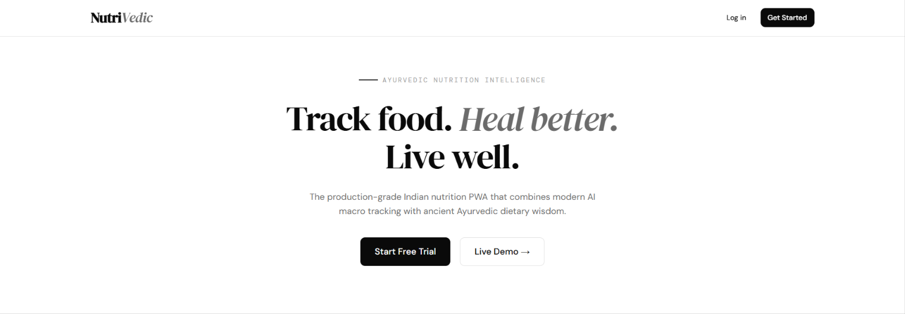
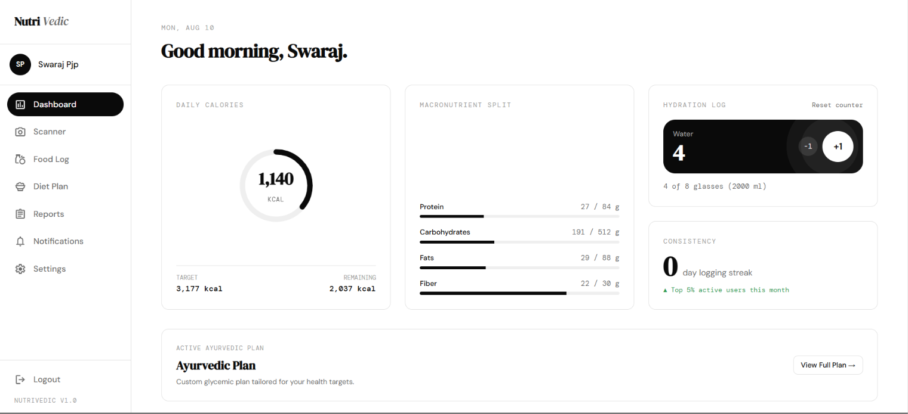
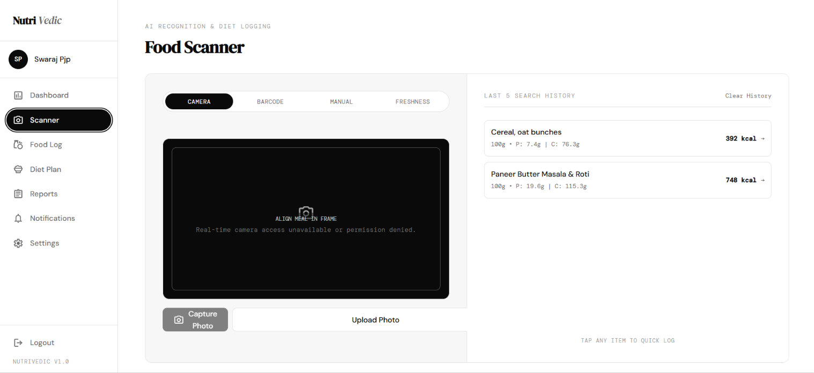
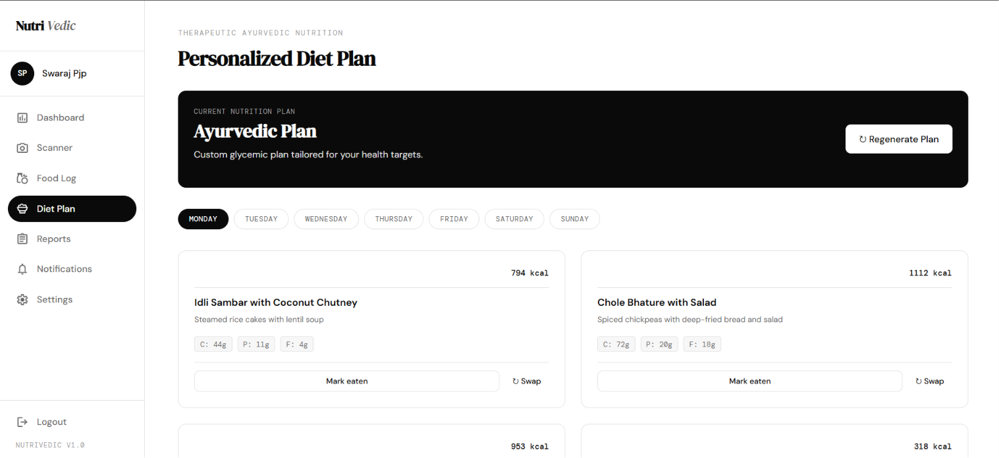
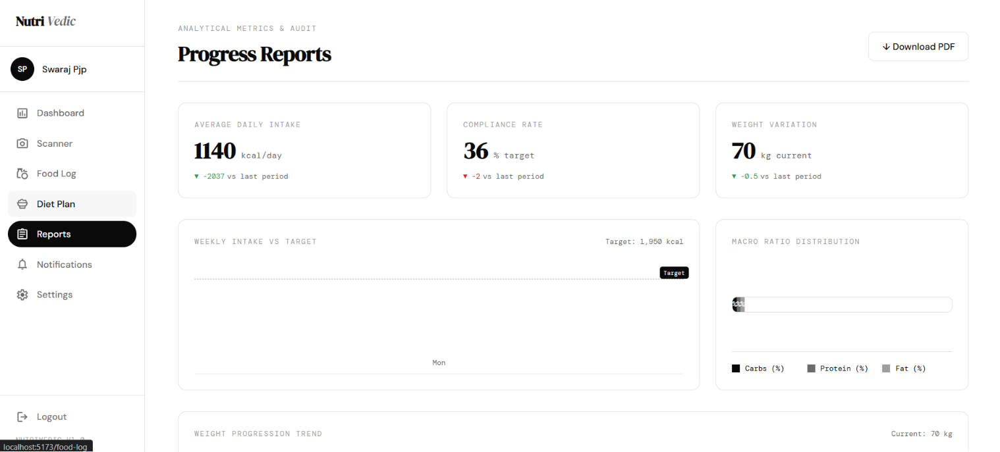

<div align="center">

  <!-- ========================================== -->
  <!-- 🎨 HERO APP BANNER PLACEHOLDER            -->
  <!-- ========================================== -->
  <!-- Replace YOUR_HERO_BANNER_IMAGE_URL with your banner link -->
  

  # 🌿 NutriVedic
  ### **AI-Powered Holistic Indian Nutrition & Smart Kitchen Management Platform**

  <p align="center">
    <strong>🏆 Event:</strong> <code>HackMatrix 2026 - Round 2</code> &nbsp;|&nbsp;
    <strong>Team Name:</strong> <code>Code Invaders</code>
  </p>

  <p align="center">
    <a href="https://github.com/Sushant-Ravi14/NutriVedic"></a>
    <a href="https://nutrivedic-backend.onrender.com/api/health"></a>
    <a href="https://documenter.getpostman.com/view/50840877/2sBY4WmveL"></a>
  </p>

</div>

---

## 📄 Project & Hackathon Meta Information

- **Event Name**: `HackMatrix 2026 - Round 2`
- **Team Name**: `Code Invaders`
- **Team Leader**: **Swaraj Prajapati** (Backend Architecture, AI & Deployment)
  - 📧 **Contact Email**: `swaraj.prajapati.cg@gmail.com`
  - 🐙 **GitHub**: [@SwarajPrajapati2006](https://github.com/SwarajPrajapati2006)
- **Team Member**: **Sushant Ravi** (Frontend UI/UX & React Architecture)
  - 🐙 **GitHub**: [@Sushant-Ravi14](https://github.com/Sushant-Ravi14)
- **Project Title**: **NutriVedic** — AI-Powered Indian Nutrition & Smart Pantry Management

---

## 🔗 Official Project Links

- 🐙 **Public GitHub Repository**: [https://github.com/Sushant-Ravi14/NutriVedic](https://github.com/Sushant-Ravi14/NutriVedic)
- 🌐 **Live Deployed API (Render)**: [https://nutrivedic-backend.onrender.com](https://nutrivedic-backend.onrender.com)
- 📚 **Interactive Postman API Docs**: [NutriVedic Postman Documentation](https://documenter.getpostman.com/view/50840877/2sBY4WmveL)
- 📹 **Demo Presentation**: Complete walkthrough covering AI Food Scanner, Therapeutic Diets & Hydration Alerts

---

## 📝 Summary

**NutriVedic** is a next-generation holistic health platform designed specifically for Indian diets and lifestyle patterns. By fusing **Google Gemini Multimodal AI Vision** with ancient **Ayurvedic principles (Pitta, Kapha, Vata)**, NutriVedic transforms how households track nutrition, manage kitchen inventory, and eliminate food waste.

---

## ❓ Problem Being Solved

1. **Inaccurate Indian Diet Tracking**: Existing nutrition apps rely on Western food databases, making it difficult to log complex Indian dishes like *Dal Tadka, Dosa, Poha, or Thalis* with accurate macros.
2. **Ignored Chronic & Therapeutic Conditions**: Conventional trackers only count calories without considering medical conditions like *Type-2 Diabetes, PCOS/PCOD, Thyroid, or Fatty Liver*.
3. **Excessive Household Food Waste**: Millions of tons of fresh produce rot in home refrigerators due to lack of expiration tracking and inventory management.
4. **Time-Consuming Cooking Preparation**: Busy individuals struggle to prepare healthy meals aligned with their cravings in short timeframes.

---

## 🌟 Unique Selling Proposition (USP)

### 💎 Premium Plan ($9 / month) — Instant AI Chef Assistant
> **Minimum Preparation Time • Craving Match • Zero Food Waste**

NutriVedic’s flagship $9/month AI Assistant bridges the gap between healthy eating and busy schedules:

- ⏱️ **Minimum Preparation Time**: Formulates delicious, healthy meals strictly within your available prep time (e.g., *10 mins, 15 mins*).
- 🥘 **Craving-to-Health Converter**: Tell the AI what you crave (e.g., *spicy, sweet, comforting*), and it instantly generates a therapeutic recipe matching your craving while maintaining your caloric & Ayurvedic targets.
- 🥑 **Expiry-Priority Pantry Integration**: Prioritizes ingredients expiring soonest in your fridge to save money and prevent food waste.

---

## ⚔️ Competitive Matrix (What We Provide vs Others)

| Feature | NutriVedic 🌿 | MyFitnessPal / Yazio ❌ | HealthifyMe ⚠️ |
| :--- | :---: | :---: | :---: |
| **Ayurvedic Dosha & Therapeutic Targeting** | ✅ Yes (Pitta/Kapha/Vata) | ❌ No | ❌ No |
| **Gemini Vision AI Food Recognition** | ✅ Instant Visual Scan | ⚠️ Paid / Text-based | ⚠️ Partial |
| **Produce Freshness & Decay AI Detection** | ✅ Yes (Shelf life estimation) | ❌ No | ❌ No |
| **$9 AI Chef (Min. Prep Time Recipes)** | ✅ Yes | ❌ No | ❌ No |
| **Indian Food & Cuisine Precision** | ✅ Tailored for Indian Diets | ⚠️ Limited | ✅ Yes |
| **Automated Expiration & Fridge Inventory** | ✅ Built-in Waste Alerter | ❌ No | ❌ No |
| **Offline Sync Queue (PWA Ready)** | ✅ Yes | ❌ Requires Connection | ❌ Requires Connection |

---

## 📌 Platform Preview & Screenshots

<div align="center">
  <table>
    <tr>
      <td width="50%" align="center">
        <b>📱 Dashboard & Daily Macro Tracking</b><br/><br/>
        
      </td>
      <td width="50%" align="center">
        <b>📸 AI Vision Scanner & Freshness Detector</b><br/><br/>
        
      </td>
    </tr>
    <tr>
      <td width="50%" align="center">
        <br/><b>🥗 Personalised Ayurvedic Diet Plan</b><br/><br/>
        
      </td>
      <td width="50%" align="center">
        <br/><b>📊 Health Reports & Analytics</b><br/><br/>
        
      </td>
    </tr>
  </table>
</div>

---

## 🚀 Key Features

- 📸 **AI Multimodal Vision Scanner**: Snap or upload a photo to instantly identify Indian dishes, compute portion weight in grams, and resolve complete macro/micronutrient profiles powered by **Google Gemini 3.6 Flash**.
- 🥬 **Produce Freshness & Spoilage AI Detector**: Scan raw fruits and vegetables to detect freshness score (0-100%), spoilage signs, remaining shelf life, and optimal Ayurvedic storage guidance.
- 🩺 **Therapeutic Condition-Specific Nutrition**: Automatically tailors 7-day Indian meal plans for chronic conditions such as *Type 2 Diabetes, Hypertension, PCOS/PCOD, Thyroid (Hypo), High Cholesterol, and Fatty Liver* with zero fried/harmful dishes.
- 🔄 **Real-Time AI Meal Swapping**: Swap any scheduled meal with one click for an Ayurvedic, condition-safe equivalent.
- 💧 **Adaptive Hydration & Local Notifications**: Calculates dynamic water intake based on body weight ($\text{Weight} \times 35\text{ ml}$), with background reminder intervals and persistent in-app message box logging.
- 🔐 **Enterprise Auth & Password Recovery**: Real-time 4-segment password strength meter, 1-click **Auto-Suggest Strong Password** generator, wrong-password auto-recovery banner, and secure Gmail SMTP password reset links.
- 📊 **Synchronized Nutrition Dashboard**: Real-time consistency between Dashboard and Food Log diary with live daily calorie donut charts, macro splits, and water intake counters.
- 📦 **Barcode & USDA Food Database**: Search 100,000+ packaged goods and Indian recipes via OpenFoodFacts and USDA FoodData Central.

---

## 🛠️ Tech Stack

- **Frontend**: React 18, Vite, TanStack React Query, Framer Motion, Tailwind CSS, Lucide Icons, PWA
- **Backend**: Node.js, Express.js, MongoDB Atlas (Mongoose), JWT Auth, Nodemailer (Gmail SMTP)
- **AI & External APIs**: Google Gemini Multimodal Vision API (`gemini-3.6-flash`), USDA FoodData Central, OpenFoodFacts
- **Database & Cache**: MongoDB Atlas, Redis Upstash Cloud
- **Services & Storage**: Cloudinary (Image Hosting), Nodemailer (Email Delivery), Sentry (Telemetry)
- **Deployment**: Render Web Service (LAN-ready, host 0.0.0.0)

---

## 🔮 Future Scope & Roadmap

- 📱 **Native Mobile App (React Native)**: Bringing NutriVedic to iOS and Android with live camera scanner overlay.
- 🛒 **Grocery Store Integration**: Direct integration with Blinkit / Instamart to auto-add missing ingredients to your cart.
- ⌚ **Wearable Sync**: Apple HealthKit and Google Fit integration for automatic calorie burn tracking.
- 🧬 **DNA & Biomarker Personalization**: Syncing blood test reports (e.g. HbA1c, Vitamin D) to refine dietary recommendations.

---

## ⚡ Setup Instructions

```bash
# 1. Clone the repository
git clone https://github.com/Sushant-Ravi14/NutriVedic.git
cd NutriVedic

# 2. Setup Backend
cd backend
## 🧪 Quick Test & Demo Commands

```bash
# Start backend server with Gmail SMTP and Gemini 3.6 Flash
cd backend
npm run dev

# Start frontend PWA dev server
cd frontend
npm run dev
```

---

<div align="center">
  <sub>Submitted for <b>HackMatrix 2026 - Round 2</b> by <b>Team Code Invaders</b> • 2026</sub>
</div>
